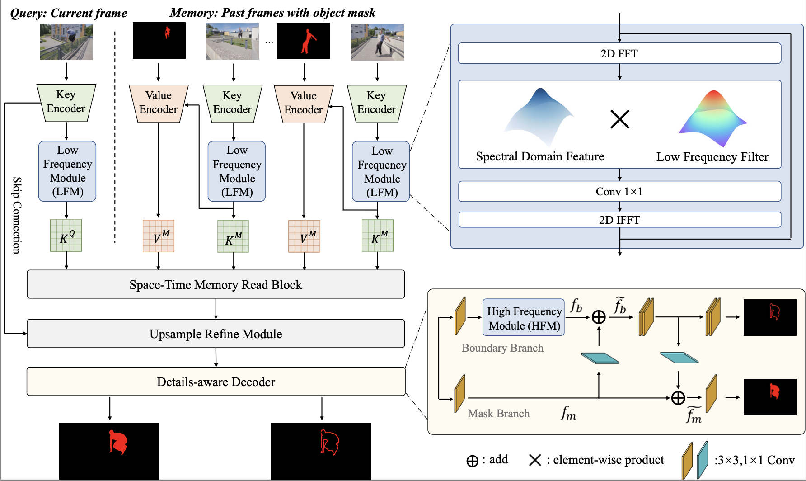

# Global Spectral Filter Memory Network for Video Object Segmentation

*ECCV 2022*

## Abstract
This paper studies semi-supervised video object segmentation through boosting intra-frame interaction. Recent memory network-based methods focus on exploiting inter-frame temporal reference while paying little attention to intra-frame spatial dependency. Specifically, these segmentation model tends to be susceptible to interference from unrelated nontarget objects in a certain frame. To this end, we propose Global Spectral Filter Memory network (GSFM), which improves intra-frame interaction through learning long-term spatial dependencies in the spectral domain. The key components of GSFM is 2D (inverse) discrete Fourier transform for spatial information mixing. Besides, we empirically find low frequency feature should be enhanced in encoder (backbone) while high frequency for decoder (segmentation head). We attribute this to semantic information extracting role for encoder and fine-grained details highlighting role for decoder. Thus, Low (High)-Frequency Module is proposed to fit this circumstance.

## Framework
 

## Demo
 

## Results
| Dataset | Split |  J&F | J | F |
| --- | :---: | :--:|:--:|:---:|
| DAVIS 2016 | val | 91.5 | 90.5 | 92.5 |
| DAVIS 2017 | val | 85.3 | 81.9 | 88.7 |
| DAVIS 2017 | test-dev | 77.8 | 74.3 | 81.2 |

| Dataset | Split | Overall Score | J-Seen | F-Seen | J-Unseen | F-Unseen
| --- | --- | :--:|:--:|:---:|:---:|:---:|
| YouTubeVOS 18 | validation | 83.8 | 82.8 | 87.6 | 78.3 | 86.3 |
<!-- | YouTubeVOS 19 | validation | 84.2 | 82.6 | 87.0 | 79.4 | 87.7 | -->

## Requirements
<!-- Similar to the baseline method [STCN](https://github.com/hkchengrex/STCN),  -->
The following packages are used in this project.
- Pytorch  1.8.1 (or higher version)
- torchvision 0.9.1 (or higher version)
- opencv
- pillow
- progressbar2
- thinspline for training (https://github.com/cheind/py-thin-plate-spline)
- gitpython
- gdown

For installing Pytorch and torchvision, please refer to the official [guideline](https://pytorch.org/).

For others, you can install them by `pip install -r requirements.txt`.

## Data Preparation
Please refer to [STCN](https://github.com/hkchengrex/STCN) to prepare the datasets and put all datasets in `/data`.
Note that in our project we only use the static datasets, DAVIS, and YouTubeVOS. (**BL30K is not used**)

## Code Structure
```xml
├── data/: here are train and test datasets.
│   ├── static
│   ├── DAVIS
│   ├── YouTube
│   ├── YouTube2018
├── datasets/: transform and dataloader for train and test datasets
├── model/: here are the code of the network and training engine(model.py)
├── saves/: here are the checkpoint obtained from training
├── scripts/: some function used to process dataset
├── util/: here are the config(hyper_para.py) and some utils
├── inference_memory_bank.py: the memory bank used in test
├── train.py
├── inference_core.py: test engine for DAVIS
├── inference_core_yv.py: test engine for YouTubeVOS
├── eval_*.py
├── requirements.txt
```

## Training
### For pretraining:
To train on the static image datasets, use the following command:

`CUDA_VISIBLE_DEVICES=[GPU_ids] OMP_NUM_THREADS=4 python -m torch.distributed.launch --master_port [cccc] --nproc_per_node=GPU_num train.py --id [save_name] --stage 0`

For example, if we use 8 GPU for training and use 's0-GSFM' as ckpt name, the command is:

`CUDA_VISIBLE_DEVICES=0,1,2,3,4,5,6,7 OMP_NUM_THREADS=4 python -m torch.distributed.launch --master_port 12345 --nproc_per_node=8 train.py --id s0-GSFM --stage 0`

### For main training:
To train on DAVIS and YouTube, use this command:

`CUDA_VISIBLE_DEVICES=[GPU_ids] OMP_NUM_THREADS=4 python -m torch.distributed.launch --master_port [cccc] --nproc_per_node=GPU_num train.py --id [save_name] --stage 3 --load_network path_to_pretrained_ckpt`

Samely, if using 8 GPU, the command is:

`CUDA_VISIBLE_DEVICES=0,1,2,3,4,5,6,7 OMP_NUM_THREADS=4 python -m torch.distributed.launch --master_port 12345 --nproc_per_node=8 train.py --id s03-GSFM --stage 3 --load_network saves/s0-GSFM/**.pth`

### Resume training
Besides, if you want to resume interrupted training, you can run the command with `--load_model` and using the `*_checkpoint.pth`, for example:

`CUDA_VISIBLE_DEVICES=0,1,2,3,4,5,6,7 OMP_NUM_THREADS=4 python -m torch.distributed.launch --master_port 12345 --nproc_per_node=8 train.py --id s03-GSFM --stage 0 --load_model saves/s0-GSFM/s0-GSFM_checkpoint.pth`

## Inference
Run the following file to perform inference on the corresponding dataset.
- `eval_davis_2016.py`  used for DAVIS 2016 val set.
- `eval_davis.py`  used for DAVIS 2017 val and test-dev set (controlled by `--split`).
- `eval_youtube.py`  used for YouTubeVOS 2018/19 val and test set.


## Evaluation
For the evaluation metric on DAVIS 2016/2017 val set, we refer to the repository [DAVIS_val](https://github.com/workforai/DAVIS-evaluation).
For DAVIS 2017 test-dev set, you can get the metric results by submitting masks to the Codalab website [DAVIS_test](https://competitions.codalab.org/competitions/20516)
For YouTube2019 val set, please submit your results to [YouTube19](https://competitions.codalab.org/competitions/20127)
For YouTube2018 val set, please submit to [YouTube18](https://competitions.codalab.org/competitions/19544)


<!-- ## Citation
If you find this work useful for your research, please cite: -->


## Acknowledgement
Code in this repository is built upon several public repositories.
Thanks to 
[STCN](https://github.com/hkchengrex/STCN),
[MiVOS](https://github.com/hkchengrex/MiVOS),
[FFC](https://github.com/pkumivision/FFC),
[BMaskR-CNN](https://github.com/hustvl/BMaskR-CNN)
for sharing their code.
